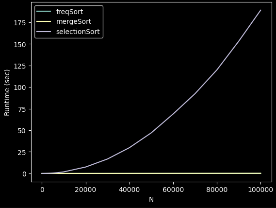
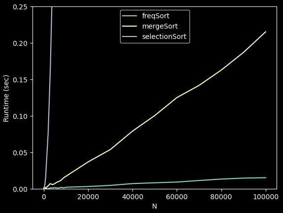

```python
import numpy as np
import random
import time
import matplotlib.pyplot as plt
```

Note that this algorithm was just a random idea that I got. Only to my knowledge this algorithm is not yet implemented by our community. Perhaps it is, but I just wanted to have fun writing an algorithm from the memory of an idea I got, and testing whether it could outperform any existing algorithms.

## Frequency Sort
This algorithm (which currently I have only implemented for integers) produces a sorted output by counting the frequencies of each element in an unsorted list.
1) It begins by taking the range of the data (max - min) and constructing a Python list with an element for each number in the range. All values are initially 0.
2) It then iterates through the input, and for each value it sees, it increments the list in step 1 corresponding to that value.
3) Once this is over, it "decompresses" that list into a sorted output list.\
\
Steps 1 and 3 are O(r), where r is the range of the data. Step 2 is O(n). These happen independently, so the overall runtime is O(r + n). If the range is miniscule, then we can say that this algorithm sorts in linear time. The same cannot be said if n is miniscule. Say our input is [1,3,2,k], where k is a massive number. Sorting this tiny almost-sorted array would require creating and iterating about a list with k elements.\
Therefore we note that space complexity can be problematic if our input has a large range.


```python
# Frequency Sort
def freq_sort(arr, minimum, maximum):
    
    freqs = [0] * (maximum - minimum + 1)
        
    # O(n)
    for v in arr:
        freqs[v - minimum] += 1

    out = []
    
    # O(r + n)
    # It looks like there is nesting (so it should be O(r * n)), but the inner loop will ALWAYS
    # run n times overall, so the time complexity of this part is always the larger of r or n.
    for i, count in enumerate(freqs):
        
        # O(frequency of v)
        # In total, this only runs n times
        out.extend([i + minimum] * count)
        
    return out
```

## Let's take an $O\textit(n*logn)$ algorithm and an $O\textit(n^2)$ algorithm to compare with.


```python
# Benchmarks

def mergeSort(arr):

    if len(arr) > 1:
        mid = len(arr) // 2
        leftHalf = arr[:mid]
        rightHalf = arr[mid:]

        mergeSort(leftHalf)
        mergeSort(rightHalf)

        i = 0
        j = 0
        k = 0
        while i < len(leftHalf) and j < len(rightHalf):
            if leftHalf[i] < rightHalf[j]:               
                arr[k] = leftHalf[i]
                i += 1
            else:
                arr[k] = rightHalf[j]          
                j += 1
            k += 1

        while i < len(leftHalf):
            arr[k] = leftHalf[i]         
            i += 1
            k += 1

        while j < len(rightHalf):
            arr[k] = rightHalf[j]
            j += 1
            k += 1
            
def selectionSort(arr, size):
    
    for idx in range(size):
        min_index = idx
    
        for j in range(idx + 1, size):

            # select the minimum element in every iteration
            if arr[j] < arr[min_index]:
                min_index = j

         # swapping the elements to sort the array
        (arr[idx], arr[min_index]) = (arr[min_index], arr[idx])
```


```python
# List of size N of random integers from 0 to 100
def rand_list(N):
    arr = []

    for i in range(N):
        arr += [random.randint(0,100)]

    return np.array(arr)

rand_list(10000)
```


    array([57, 57, 66, ..., 38, 12, 58])


```python
# Our benchmark is the time taken to complete the sorting. We will use values of N ranging from 10 to 100,000.

sizes = list(range(10,100,10)) + list(range(100,1000,100)) + \
                            list(range(1000,10000,1000)) + \
                            list(range(10000,100000,10000)) + [100000]

runtimes1 = np.array([]) # Freqeuncy Sort
runtimes2 = np.array([]) # Merge Sort
runtimes3 = np.array([]) # Selection Sort

for s in sizes:
    arr = rand_list(s)

    # Frequency Sort
    start = time.time()
    sorted_arr = freq_sort(arr, min(arr), max(arr))
    runtime = time.time() - start
    runtimes1 = np.append(runtimes1, runtime)
    
    # Merge Sort
    arr2 = list(arr.copy())
    start = time.time()
    mergeSort(arr2)
    runtime = time.time() - start
    runtimes2 = np.append(runtimes2, runtime)
    sorted_arr2 = arr2
    
    # Selection Sort
    arr3 = list(arr.copy())
    start = time.time()
    selectionSort(arr3, len(arr3))
    runtime = time.time() - start
    runtimes3 = np.append(runtimes3, runtime)
    sorted_arr3 = arr3
    
    # Verify each algorithm produces the same output
    if (np.sum(np.array(sorted_arr, dtype=np.uint8) == np.array(sorted_arr2, dtype=np.uint8)) != s):
        print("ERROR between first and second sort")
        break
    elif (np.sum(np.array(sorted_arr, dtype=np.uint8) == np.array(sorted_arr3, dtype=np.uint8)) != s):
        print("ERROR between first and third sort")
        break
    elif (np.sum(np.array(sorted_arr2, dtype=np.uint8) == np.array(sorted_arr3, dtype=np.uint8)) != s):
        print("ERROR between second and third sort")
        break
```

## Let's plot the runtimes against different choices of N
Note that the axes are in white, so please switch to dark mode if you would like to see them.


```python
plt.plot(sizes, runtimes1, label='freqSort')
plt.plot(sizes, runtimes2, label='mergeSort')
plt.plot(sizes, runtimes3, label='selectionSort')

plt.xlabel('N', color='white')
plt.ylabel('Runtime (sec)', color='white')
plt.legend()

plt.tick_params(axis='both', colors='white')
```


    

    


```python
plt.plot(sizes, runtimes1, label='freqSort')
plt.plot(sizes, runtimes2, label='mergeSort')
plt.plot(sizes, runtimes3, label='selectionSort')

plt.xlabel('N', color='white')
plt.ylabel('Runtime (sec)', color='white')
plt.legend()

plt.ylim(0, 0.25)

plt.tick_params(axis='both', colors='white')
```


    

    


Looks like we way outperform selectionSort, which is to be expected. We also outperform MergeSort, which is also expected due to the linear time complexity we predicted. 

## Summary
This algorithm beats some of our fastest algorithms like MergeSort and QuickSort. However, the caveat is space complexity. If our input to be sorted contains a potentially massive range of values, this algorithm may not be the best choice, and might even extend past a machine's memory capabilities. For very large arrays with a small range, Frequency Sort is the better choice. For arrays with large range values, traditional fast sorting algorithms are better.
