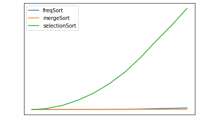
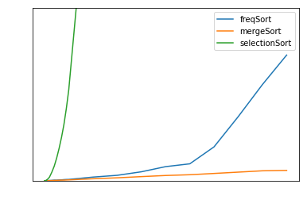

```python
import numpy as np
import random
import time
import matplotlib.pyplot as plt
```

Note that this algorithm was just a random idea that I got. Only to my knowledge this algorithm is not yet implemented. Perhaps it is, but I just wanted to have fun writing an algorithm from the memory of an idea I got, and testing whether it could outperform any existing algorithms.

## Frequency Sort
This algorithm (which currently only works with integers) counts the frequencies of each element in an unsorted list.
1) It begins by taking the range of the data (max - min) and constructing a Python dictionary with keys from min to max. All values are initially 0.
2) It then iterates through the input, and for each element it sees, it increments the value corresponding to that key.
3) Once this is over, it "decompresses" that dictionary into an output list.\
\
Steps 1 and 3 are O(r), where r is the range of the data. Step 2 is O(n). These happen independently, so the overall runtime is O(r + n). If the range is miniscule, then we can say that this algorithm sorts in linear time. The same cannot be said for if n is miniscule. Say our input is [1,3,2,1000], this algorithm would need a dictionary with 1000 keys.\
Note that space complexity can also really bad. We will need a dictionary with r keys (where r is range). So if the data have a very large range, then this algorithm will take up a large amount of memory.


```python
# Frequency Sort
def freq_sort(arr, mi, ma):
    
    freqs = {}
    
    # O(r)
    for v in range(mi, ma+1):
        freqs[v] = 0
        
    # O(n)
    for v in arr:
        freqs[v] += 1
        
    out = np.array([])
    
    # O(r + n)
    # It looks like there is nesting (so it should be O(rn)), but the inner loop will ALWAYS
    # run n times. So the time complexity of this part matters only on which of r or n is larger.
    for v in freqs.keys():
        
        # O(frequency of this element)
        # In total this only runs n times
        for _ in range(freqs[v]):
            out = np.append(out, v)
    
    return out
```

## Let's take an $O\textit(n*logn)$ algorithm and an $O\textit(n^2)$ algorithm to compare with.


```python
# Benchmarks

def mergeSort(alist):
    if len(alist)>1:
        mid = len(alist)//2
        lefthalf = alist[:mid]
        righthalf = alist[mid:]

        mergeSort(lefthalf)
        mergeSort(righthalf)
        i=0
        j=0
        k=0
        while i < len(lefthalf) and j < len(righthalf):
            if lefthalf[i] < righthalf[j]:               
                alist[k]=lefthalf[i]
                i=i+1
            else:
                alist[k]=righthalf[j]          
                j=j+1
            k=k+1


        while i < len(lefthalf):
            alist[k]=lefthalf[i]         
            i=i+1
            k=k+1

        while j < len(righthalf):
            alist[k]=righthalf[j]
            j=j+1
            k=k+1
            
def selectionSort(array, size):
    
    for ind in range(size):
        min_index = ind
    
        for j in range(ind + 1, size):
            # select the minimum element in every iteration
            if array[j] < array[min_index]:
                min_index = j
         # swapping the elements to sort the array
        (array[ind], array[min_index]) = (array[min_index], array[ind])
```


```python
# List of size N of random integers from 0 to 100
def rand_list(N):
    arr = []

    for i in range(N):
        arr += [random.randint(0,100)]

    return np.array(arr)
rand_list(10000)
```


    array([57, 57, 66, ..., 38, 12, 58])


```python
# We will get benchmarks for certain sorting algorithms based on increasing values of N
sizes = list(range(10,100,10)) + list(range(100,1001,100)) + \
                            list(range(1000,10000,1000)) + \
                            list(range(10000,100000,10000)) + [100000]

runtimes1 = np.array([])
runtimes2 = np.array([])
runtimes3 = np.array([])
for s in sizes:
    arr = rand_list(s)

    # Frequency Sort
    mi, ma = min(arr),max(arr)
    start = time.time()
    sorted_arr = freq_sort(arr,mi,ma)
    runtimes1 = np.append(runtimes1, time.time()-start)
    
    # Merge Sort
    ar1 = list(arr.copy())
    start = time.time()
    mergeSort(ar1)
    sorted_arr2 = ar1
    runtimes2 = np.append(runtimes2, time.time()-start)
    
    # Selection Sort
    ar2 = list(arr.copy())
    si = len(ar2)
    start = time.time()
    selectionSort(ar2, si)
    sorted_arr3 = ar2
    runtimes3 = np.append(runtimes3, time.time()-start)
    
    # If the arrays are not equivalent, then one of the sorting algoritms is wrong
    if (np.sum(np.array(sorted_arr, dtype=np.uint8) == np.array(sorted_arr2, dtype=np.uint8)) != s):
        print("ERROR between first and second sort")
        break
    elif (np.sum(np.array(sorted_arr, dtype=np.uint8) == np.array(sorted_arr3, dtype=np.uint8)) != s):
        print("ERROR between first and third sort")
        break
    elif (np.sum(np.array(sorted_arr2, dtype=np.uint8) == np.array(sorted_arr3, dtype=np.uint8)) != s):
        print("ERROR between second and third sort")
        break
```

## Let's plot the runtimes against different choice of N
Note that the axes are in white, so please switch to dark mode if you would like to see them.


```python
plt.plot(sizes, runtimes1, label='freqSort')
plt.plot(sizes, runtimes2, label='mergeSort')
plt.plot(sizes, runtimes3, label='selectionSort')

plt.xlabel('N', color='white')
plt.ylabel('Runtime (sec)', color='white')
plt.legend()

plt.tick_params(axis='both', colors='white')
```


    

    


```python
plt.plot(sizes, runtimes1, label='freqSort')
plt.plot(sizes, runtimes2, label='mergeSort')
plt.plot(sizes, runtimes3, label='selectionSort')

plt.xlabel('N', color='white')
plt.ylabel('Runtime (sec)', color='white')
plt.legend()

plt.ylim(0, 10)

plt.tick_params(axis='both', colors='white')
```


    

    


Looks like we way outperform selectionSort, which is to be expected. We actually get pretty close to mergesort in the long run. But when we take a closer look, mergeSort seems to be way faster! Mergesort always stays below 1 second, while frequency sort explodes out of nowhere. This is even with a constant range.

## Summary
Either mergesort/quicksort/etc. are simply better, or frequency sort needs some optimizations.
